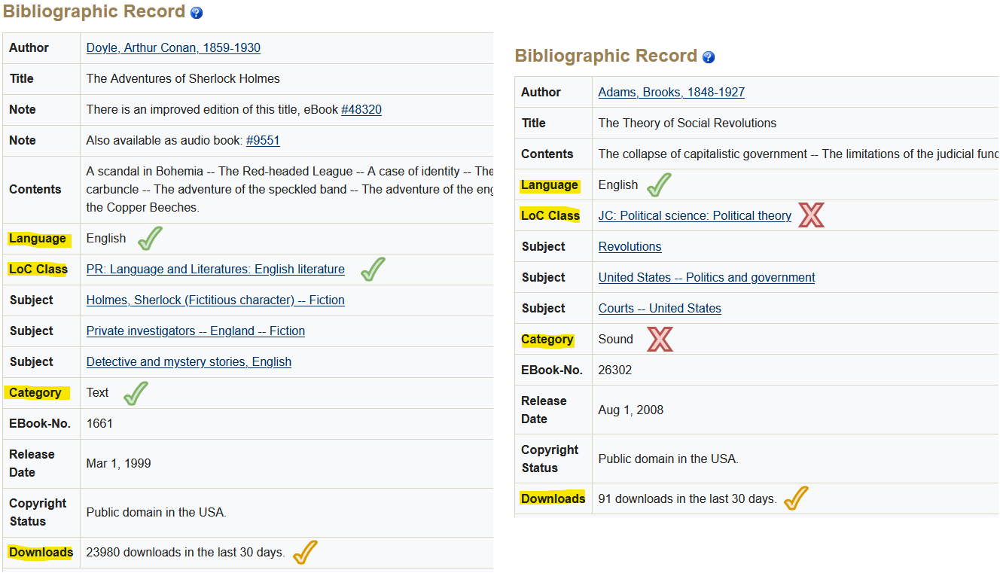
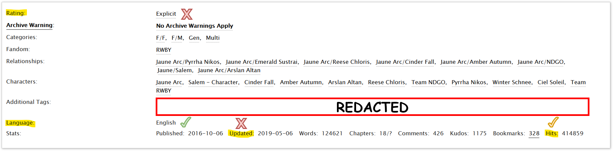

```{r setup, include=FALSE}
library(wordcloud)
library(RColorBrewer)
library(plotly)
library(ggplot2)
library(dplyr)
library(tidyverse)
library(data.table)
library(knitr)

knitr::opts_chunk$set(echo = FALSE, warning = FALSE, message = FALSE)

#CSV imports
df.word<-read.csv( './static/POS_word.csv' )
df.word.summary<-read.csv( './static/POS_word_summary.csv' )
df.punc<-read.csv( './static/POS_punctuation.csv' )
df.pos<-read.csv( './static/POS_all.csv' )
df.ss_s<-read.csv( './static/SS_simple.csv' )
# df.ss_c<-read.csv( './static/SS_complex.csv' )
df.sample_notes<-read.csv( './static/Sample_notes.csv' )
# dlog <- read.csv( './static/fanfics.csv' )
# books_words <- read.csv( './static/1.csv' )
# fanfic_words <- read.csv( './static/2.csv' )

#Duplicates for differences in variable names used
POS_word <- df.word
POS_punct <- df.punc
SS_simple <- df.ss_s

#For graph labeling
POS_word$lit_type<-gsub("Book","Classic Literature",POS_word$lit_type)
POS_punct$lit_type<-gsub("Book","Classic Literature",POS_punct$lit_type)
SS_simple$lit_type<-gsub("Book","Classic Literature",SS_simple$lit_type)
```

# Introduction
The following is a comparison of classical literature and modern fanfiction based on structural elements of each, like word usage and sentence structure.  We drew both types of literature from internet sources, specifically [Gutenberg Archive](https://www.gutenberg.org/) for classics and [Archive of Our Own](https://archiveofourown.org/) for fanfiction.  

To test our methods, we use a random sample of 10 classics and 10 fanfictions, and then performs several types of analysis on each.  Although we used a small sample for this test, our method is scalable for much larger inputs.

This document will walk you through the process of how we acquired our data, what we did with it, and what we found.  

<!--chapter:end:R/01-introduction.Rmd-->

# Developing A Corpus
For the sake of simplicity, 10 examples of classic literature and 10 examples of modern fan-fiction were included in the corpus of texts on which to conduct our analysis, though infastructure allows for any given amount of each.

## Text Aquisition
The classic literature and modern fan-fiction texts were both sourced from online collections: Project Gutenberg and Archive of Our Own, respectively. 

Project Gutenberg is a collection of published digital works, written and otherwise that are not currently protected by copyright. The collection is aggregated by volunteers in the effort to promote literacy, education, opportunity, and enlightenment. 

Archive of Our Own is a "fan-created, fan-run, nonprofit, noncommercial archive for transformative fanworks." There is no review board; registered users are allowed to write and upload whatever suits their inclinations.

```{r echo=FALSE}
data.frame(
Count = c(10, 10),
Source = "",
row.names = c("Classic Literature","Modern Fan Fiction")
) %>%
  kableExtra::kbl(booktabs = T, align = "c") %>%
  kableExtra::kable_paper(full_width = F) %>%
  kableExtra::row_spec(1:2, bold = T) %>%
  kableExtra::column_spec(2, image = kableExtra::spec_image( c("./static/project_gutenberg.png","./static/archive_of_our_own.png"), 200, 200))
```

Content and accompanying meta information (e.g. title) of each work was obtained via web scraping. Web scraping is an automatic technique which collects content on the Internet directly from the source (i.e. from the Project Gutenberg and Archive of Our Own website itself). This was done to ensure that the collection was current (works are constantly added, updated, and altered).

## Text Selection
All the classic literature and modern fan-fiction texts in the analyzed corpus were randomly selected, though functionality to have specific works make up any/all of the corpus exist. Although most works in the Project Gutenberg collection are notable, Archive of Our Own hosts content which, for all practical purposes, has never been accessed outside of the author themselves. To ensure moderate popularity, we selected from a smaller subset of the each respective collection: the top 1000 most popular works. This appeared to be the more practical approach than arbitrarily setting a popularity threshold value, though such functionality does exist. A randomly selected work must pass all validation criteria (see Table \@ref(tab:validationcriteria) and Figures \@ref(fig:valid_PG) - \@ref(fig:invalid_AOO)) for inclusion in the corpus.

```{r echo=FALSE}
data.frame(
Items = c("Exists", "Language", "Popularity", "Rank", "Written", "Literature", "Explicitness", "Completed"),
Features = c(
"Ensures the randomly generated unique identification number actually references a specific work in the collection",
"Ensures the work is compiled in English for consistency across analysis metrics",
"Ensures the work is sufficiently popular by exceeding the minimum popularity metric value: downloads in the last 30 days (classic literature) or total hits (fan fiction); defaultly, there is no popularity requirement",
"Optional criteria which ensures a work to be in the top n works in the entire collection based on the respective popularity metric in descending order",
"Ensures the work is digitally written as opposed to being an audio book, music sheet, picture(s), etc.",
"Ensures the work is considered literature under the collection categorization system",
"Ensures the fan-fiction is not explicitly rated; mature is acceptable",
"Ensures the fan-fiction is no longer recieving any updates (i.e. new chapter releases). This ensures that the works are more comparable across the different collections"
)
) %>%
  kableExtra::kbl(booktabs = T, caption = "Criteria for Corpus Inclusion", label = "validationcriteria") %>%
  kableExtra::kable_styling(full_width = F) %>%
  # kableExtra::column_spec(1, bold = T) %>%
  kableExtra::column_spec(2, width = "30em") %>%
  kableExtra::pack_rows("Classic Literature Only", 5, 6) %>%
  kableExtra::pack_rows("Modern Fan-fiction Only", 7, 8)
```

```{r label = valid_invalid_PG, fig.cap = "Example of (Left) valid, and therefore corpus includable Project Gutenberg work; (Right) invalid, and therefore corpus excluded Project Gutenberg work"}

```

```{r label = valid_AOO, fig.cap = "Example of a valid, and therefore corpus includable, Archive of Our Own work"}
knitr::include_graphics("./static/valid_AOO.png")
```

```{r  label = invalid_AOO, fig.cap = "Example of an invalid, and therefore corpus excluded, Archive of Our Own work"}

```

## Text Preprocessing
Before analysis may commence, the works must formatted for consistent formatting/representation. Project Gutenberg and Archive of Our Own have different methods in which to format the works they distribute. For example, the use of fancy quotes (“/”) as opposed to standard quotes ("). Logically, these representations have comparable meanings; a computer, however interprets them as complete different. This pre-analysis text manipulation is called preprocessing.

Archive of Our Own has a consistent and rigid underlying structure for the layout and distribution of a work, regarldess of its release date. In other words, each work follows a template of how the text body should look. This made identifying the start, stop, and individual paragraphs straightforward.

On the other hand, Project Gutenberg has no such consistency; Disclaimers, meta-information (e.g. Producer), and full licensing details are all included in the text file containing the work and denoted in varying ways depending on the guidlelines in place at the work's release. Therefore, the first preprocessing step for all classic literature texts is the extraction of the work's relevant text.

The remaining preprocessing steps are briefly outlined below. For more detail, reference the technical documentation.

2) Separate the text into paragraphs
3) Remove mid-paragraph newline characters (Project Gutenberg only)
4) Strip leading and trailing whitespace
5) Convert fancy formatting into simple formatting (UTF-8 to ASCII)

Unprocessed excerpt

> \\n\\n“Wake up, Alice dear!” said her sister; “Why, what a long sleep you’ve\\nhad!”     
>
> --- _Alice's Adventures in Wonderland by Lewis Carroll_

Processed excerpt

> <mark>\"</mark>Wake up, Alice dear!<mark>"</mark> said her sister; <mark>\"</mark>Why, what a long sleep you<mark>\\\'</mark>ve had!<mark>"</mark>

<!--chapter:end:R/02-text_aquisition.Rmd-->

# Corpus Overview

This section is a brief look at what our test sample consists of, to provide context for later analysis.

## Classic Literature
```{r,echo=FALSE} 
#dfList<-unique(df.punc %>% select(lit_type,title,author) %>% arrange(title))
#dfList$title<-gsub("è","e",gsub("\n","",dfList$title))
#dfList.class<-subset(dfList,lit_type=="Book")
#dfList.ff<-subset(dfList,lit_type=="Fanfiction")

dfList.ff<-df.sample_notes[1:10,]
dfList.class<-df.sample_notes[11:20,]

table.class <- plot_ly(
  type = 'table',
  columnwidth = c(150, 100,100),
  columnorder = c(0, 1, 2),
  header = list(
    values = c("Title","Author","Notes"),
    align = c("center", "center","center"),
    line = list(width = 1, color = 'black'),
    fill = list(color = c("grey", "grey")),
    font = list(family = "Arial", size = 14, color = "white")
  ),
  cells = list(
    values = rbind(dfList.class$Title, dfList.class$Author,dfList.class$Notes),
    align = c("left", "left","left"),
    line = list(color = "black", width = 1),
    font = list(family = "Arial", size = 12, color = c("black"))
  ))
table.class

```
## Modern Fanfiction
```{r,echo=FALSE} 
table.ff <- plot_ly(
  type = 'table',
  columnwidth = c(150, 100,100),
  columnorder = c(0, 1, 2),
  header = list(
    values = c("Title","Author","Fandom"),
    align = c("center", "center","center"),
    line = list(width = 1, color = 'black'),
    fill = list(color = c("grey", "grey")),
    font = list(family = "Arial", size = 14, color = "white")
  ),
  cells = list(
    values = rbind(dfList.ff$Title, dfList.ff$Author,dfList.ff$Notes),
    align = c("left", "left","left"),
    line = list(color = "black", width = 1),
    font = list(family = "Arial", size = 12, color = c("black"))
  ))
table.ff
```

There's a great deal of variation in our classic literature sample that's not immediately apparent from the text.  Three are translations: one from ancient Greek, one from middle English, and one from modern German.  (Oedipus, Sir Gawayne, & Struwwelpeter.)  Three are children's stories(Three little pigs, Secret Garden & Struwwelpeter) two plays(Oedipus and Way of the World), and two poems(Sir Gawayne and Aurora Leigh). The earliest was written in 5th century BC, while the most recent was written in 1953.  

On the fanfiction end, our sample is in some ways much more homogeneous.  Unsurprisingly, since we're lookg at "Modern Fanfiction", all are from the 21st century.  They come from a diverse range of fandoms, although it's worth noting that, with the exception of 'I'd Forgotten People are Kind', a real-person fanfic about a blogger, all fall into either the Sci-Fi or Fantasy genres.  Unlike classic literature, where there's been a greater degree of academic study, genre is difficult to pin down in fanfiction.  One could say that the fanfic inherits the genre of its fandom, but that limits the genre of a story to its setting.
  Based on a highly subjective reading of story tags, 7 appear to have strong romance elements, with tags like "Soulmate","Courtship", or, helpfully, "Romance."  The other three (That Awkard Moment..., I'd Forgotten People are Kind, "Back From the Future..."), appear to be comedies (Humor), or Hurt/Comfort, a relationship driven genre can be, but is not always, platonic.

Since there subjectively seems to be more variation in our classic literature sample, compared to our sample fanfiction, let's look at a few structural differences and see if this potential difference is reflected there.

<!--chapter:end:R/03-sample_overview.Rmd-->

---
title: "Method (data processing)"
author: "Thomas FitzGerald, Mei Maddox, Kyle Rodriguez"
date: "4/13/2022"
output: html_document
---

#Data Processing Method
To process our corpus, we used Spark, a distributed computing platform well-suited to handling large amounts of data.  This means that, although our test sample only used 20 stories total, our method should scale reasonably well if we were to run hundreds or thousands of stories.

Each book or fanfiction in our corpus was broken down into a list of sentences.  We used spark to run natural language processing
from the nltk package on each sentence, converting that sentence into a list of tokens.  Each token represents a word or punctuation mark, which, through some additional processing, becomes the data we produced.

Nltk does a fairly good job of determining parts of speech, using context to guess part of speech for unknown terms.  There are a few cases that return odd results (for example, a non-standard ellipse, like '....', often returns as a noun), but, on average, it's pretty accurate.

The data returns as a series of .csv's, one aggregated by literature type, and one broken down by individual story.  The second one would not scale well to thousands of pieces, but could be modified to look at variance within each literature type.

<!--chapter:end:R/04-data_processing_method.Rmd-->

# Findings - Words and Punctuation
## Word Count
```{r}
df.both.words<-df.word %>%
  group_by(lit_type,title) %>%
  summarise(word_count = sum(count)) %>%
  arrange(desc(word_count))
df.lit.words<-subset(df.word,lit_type=="Book") %>%
  select(title,POS_word,count) %>%
  group_by(title) %>%
  summarise(word_count = sum(count)) %>%
  arrange(desc(word_count))
df.ff.words<-subset(df.word,lit_type=="Fanfiction") %>%
  select(title,POS_word,count) %>%
  group_by(title) %>%
  summarise(word_count = sum(count)) %>%
  arrange(desc(word_count))

df.both.words$lit_type<-gsub("Book","Classic Literature",df.both.words$lit_type)
p<-ggplot(data=df.both.words,aes(x=lit_type,y=word_count,fill=lit_type)) +
  geom_bar(stat="identity",position="dodge2") +
  theme_minimal()+labs(x='Literature Type',y='Word Count')
p <- p + guides(fill=guide_legend(title="Literature Type"))
p
  
fig.word.count <- plot_ly(x = df.lit.words$word_count, type = "box", quartilemethod="linear", name="Classic Literature") %>%
  add_trace(x = df.ff.words$word_count, quartilemethod="linear", name="Modern Fanfiction") %>%
  layout(title = "Word Counts by Literature Type")
fig.word.count
```
In our sample, the longest piece of classic literature is Aurora Leigh, at 89,224 words, while the shortest is the three little pigs, at 1,109, meaning our longest piece is almost 90 times the length of our shortest.

On the fanfiction side, our longest is The Marks we Make, at 270,559 words, while the shortest is That Awkward Moment When Your Whole Class Shows up At Your House, at 28,918, just shy of a tenth the length of our longest.  It does make up for it by having the longest title, however.

Although the extremes of our classic lit. sample are proportionally much more spread out, they're actually distributed much more evenly, as can be seen by the squat inner quartiles in the graph above.

There are certainly examples outside our sample of one group far surpassing the other in either direction: War and Peace is nearly 600,000 words, while the entire genre colloquially known as "CrackFic" is premised around being under 100.

## Punctuation

```{r echo = FALSE}
p<-ggplot(data=POS_punct,aes(x=POS_punctuation , y=proportion,fill=lit_type))+
  geom_bar(stat = 'identity',position = 'dodge')+
  theme_minimal()+ scale_y_continuous(expand=expansion(mult=c(0,0.1)))+labs(x='part of speech',y='proportion')
p <- p + guides(fill=guide_legend(title="Literature Type"))
p
```
Above we can see the punctuation used

It's worth nothing that the method we used for tokenizing punctuation results in a lot of simplification: colons, semi-colons, and ellipses are all classified as ':'.  Exclamation marks and periods are considered the same.  Despite this, there's still a bit that can be gleaned from this graphic: classic literature has a higher proportion of commas and partial sentence breaks, which might point towards more compound sentences, and the hashtag only appears in our fanfiction sample.

<!--chapter:end:R/05-words_and_punctuation.Rmd-->

# Findings 2 - Parts of Speech
## Part of Speech

Next, we're going to look at parts of speech (POS).  The natural language processing method we used recognizes ~34 'parts of speech', with most of the 'extra' POS in the package being more specific applications of the main 8 English POS.  For example, 'big','bigger',and 'biggest' are all adjectives, but the package would categorize them as simple, comparative, and superlative adjectives.

We're going to look at what proportion of the text of each story the 6 most common parts of speech make up.  These are singular nouns, pronouns,prepositions,determiners (the, a, that), simple adjectives, and simple adverbs.

```{r, echo=FALSE}
#Classic Lit: Top 5 POS
df.lit.words<- subset(df.word,lit_type=="Book") %>%
  select(title,POS_word,proportion)

df.lit.words$title<-gsub("è","e",gsub("\n","",df.lit.words$title))

df.lit.words.top5 <-subset(df.lit.words,POS_word %in% c('NN','IN','PRP','DT','JJ','RB')) %>%
  arrange(POS_word,desc(proportion))

df.lit.words.top5$proportion<-df.lit.words.top5$proportion*100

#Box
fig.class.nn <- plot_ly(x = subset(df.lit.words.top5,POS_word=='NN')$proportion, type = "box", quartilemethod="linear", name="Singular Nouns") %>%
  add_trace(x = subset(df.lit.words.top5,POS_word=='IN')$proportion, type = "box", quartilemethod="linear", name="Preposition") %>%
  add_trace(x = subset(df.lit.words.top5,POS_word=='PRP')$proportion, type = "box", quartilemethod="linear", name="Pronouns") %>%
  add_trace(x = subset(df.lit.words.top5,POS_word=='DT')$proportion, type = "box", quartilemethod="linear", name="Determiners") %>%
  add_trace(x = subset(df.lit.words.top5,POS_word=='JJ')$proportion, type = "box", quartilemethod="linear", name="Adjectives") %>%
  add_trace(x = subset(df.lit.words.top5,POS_word=='RB')$proportion, type = "box", quartilemethod="linear", name="Adverb") %>%
  layout(title = "Top 6 POS - Classic Literature",
        yaxis = list(title="Part of Speech"),
        xaxis = list(title="Percentage of Words in Text",range=c(0,25)),
        legend= list(traceorder='reversed')
        )
        
fig.class.nn
#df.lit.words.top5
```
```{r, echo=FALSE}
#Fanfiction: Top 5 POS
df.lit.words<- subset(df.word,lit_type=="Fanfiction") %>%
  select(title,POS_word,proportion)

df.lit.words.top5 <-subset(df.lit.words,POS_word %in% c('NN','IN','PRP','DT','JJ','RB')) %>%
  arrange(POS_word,desc(proportion))

df.lit.words.top5$proportion<-df.lit.words.top5$proportion*100

#Box
fig.class.nn <- plot_ly(x = subset(df.lit.words.top5,POS_word=='NN')$proportion, type = "box", quartilemethod="linear", name="Singular Nouns") %>%
  add_trace(x = subset(df.lit.words.top5,POS_word=='IN')$proportion, type = "box", quartilemethod="linear", name="Preposition") %>%
  add_trace(x = subset(df.lit.words.top5,POS_word=='PRP')$proportion, type = "box", quartilemethod="linear", name="Pronouns") %>%
  add_trace(x = subset(df.lit.words.top5,POS_word=='DT')$proportion, type = "box", quartilemethod="linear", name="Determiners") %>%
  add_trace(x = subset(df.lit.words.top5,POS_word=='JJ')$proportion, type = "box", quartilemethod="linear", name="Adjectives") %>%
  add_trace(x = subset(df.lit.words.top5,POS_word=='RB')$proportion, type = "box", quartilemethod="linear", name="Adverb") %>%
  layout(title = "Top 6 POS - Fanfiction",
        yaxis = list(title="Part of Speech"),
        xaxis = list(title="Percentage of Words in Text",range=c(0,25)),
        legend= list(traceorder='reversed')
        )
fig.class.nn
#df.lit.words.top5
```
What really stands out here is, again, that there's a lot of variation in our classical literature that we're not seeing in our fanfiction sample.  However, every part of speech has at least one story from our sample that is a statistical outlier compared to the others.  Also noteworthy is the proportionally smaller number of singular nouns used in fanfiction.


```{r echo = FALSE}
POS_word_new <- POS_word %>% filter(POS_word == 'JJ'|POS_word == 'IN'|POS_word == 'NN'|POS_word == 'NNP'|POS_word == 'RB'|POS_word == 'VB'|POS_word == 'PRP') %>% mutate(POS_word=recode(POS_word,JJ='adjective',IN = 'preposition',NN= 'noun',NNP= 'proper_noun','RB'= 'adverb', VB = 'verb',PRP='pronoun'))
```

```{r echo = FALSE}
p<-ggplot(data=POS_word_new,aes(x=POS_word , y=proportion,fill=lit_type))+
  geom_bar(stat = 'identity',position = 'dodge') +theme_minimal()+scale_y_continuous(expand=expansion(mult=c(0,0.1)))+theme(axis.text.x = element_text(angle = 45, hjust=1))+labs(x='part of speech',y='proportion')
p <- p + guides(fill=guide_legend(title="Literature Type"))
p
```
As we discovered the parts of speech in comparison to the overall words, books had more of these major categories. It is interesting to note that books used more nouns and pronouns than fanfictions.  

```{r echo = FALSE}
books_words[is.na(books_words)]<-0
wordcloud(words = books_words$X1 , freq = books_words$X2 , min.freq = 200,max.words=200, random.order=F, random.color = T, rot.per=0.35,colors=brewer.pal(8,'Dark2'))
```

We see here that books use more variety of pronouns the same amount of times.  

```{r echo = FALSE}
fanfic_words[is.na(fanfic_words)]<-0
wordcloud(words = fanfic_words$X_1 , freq = fanfic_words$X_2 , min.freq = 200,max.words=200, random.order=F,random.color = T, rot.per=0.35,colors=brewer.pal(8,'Dark2'))
```

Where as the fan fictions tend to use he and his and him more.  

<!--chapter:end:R/06-parts_of_speech.Rmd-->

# Sentence Structure
Another aspect we looked at was the number of unique sentence structures (SS) in each story.  As it turns out, there are MANY ways to put together a sentence in English, so in this case we used an (extra) simplified way of structuring a sentence: nouns (including pronouns), verbs, adjectives, and adverbs only, no punctuation.  Despite this, we still had stories with nearly (but not over) 9,000 unique sentence structures.

```{r echo=FALSE}
SS_simple_fic <- SS_simple %>% filter(count > 50,lit_type =='Fanfiction')
SS_simple_book <- SS_simple %>% filter(count > 50,lit_type =='Classic Literature ')
```

```{r echo=FALSE,results='asis'}
kable(SS_simple_fic[,2:3])
```

Above we see our raw output of numbers for sentence structure of the fan fictions. There are many types of structures so we decided to keep the count above 50 for each literary type.  With this restriction we have 23 different sentence structures for fan fictions.  


```{r echo=FALSE,results='asis'}
kable(SS_simple_book[,2:3])
```

For books we see that there are only 6 different structures used more than 50 times. We also checked to see if we were at just the cusp of where books start to use more structures and we found that not many more structures were used more than 30 times. It is reasonable to assume that books have a higher variety of sentence structures leading to lower counts.  

```{r}
df.lit.sent<-subset(df.ss_s,lit_type=="Book") %>%
  select(title,SS_simple,count) %>%
  group_by(title) %>%
  summarise(count = sum(count)) %>%
  arrange(desc(count))
df.ff.sent<-subset(df.ss_s,lit_type=="Fanfiction") %>%
  select(title,SS_simple,count) %>%
  group_by(title) %>%
  summarise(count = sum(count)) %>%
  arrange(desc(count))

df.lit.words<-subset(df.word,lit_type=="Book") %>%
  select(title,POS_word,count) %>%
  group_by(title) %>%
  summarise(word_count = sum(count)) %>%
  arrange(desc(word_count))
df.ff.words<-subset(df.word,lit_type=="Fanfiction") %>%
  select(title,POS_word,count) %>%
  group_by(title) %>%
  summarise(word_count = sum(count)) %>%
  arrange(desc(word_count))

df.lit<-cbind(df.lit.words,unique_sentences=df.lit.sent$count[match(df.lit.words$title,df.lit.sent$title)])
df.ff<-cbind(df.ff.words,unique_sentences=df.ff.sent$count[match(df.ff.words$title,df.ff.sent$title)])
df.lit$lit_type<-"Classic Literature"
df.ff$lit_type<-"Fanfiction"
df.scatter<-rbind(df.lit,df.ff)

p<-ggplot(data=df.scatter, aes(x=word_count, y=unique_sentences,col=lit_type,group=lit_type)) + 
  geom_point() +
  geom_smooth(method=lm, aes(color=lit_type))+
  labs(title="Unique Sentence Structure and Story Length",
       x="Length (Word Count)", y = "Unique Sentence Structures")+
  theme_classic()
p<-p + scale_x_continuous(labels = scales::comma)
p<-p + scale_y_continuous(labels = scales::comma)
p <- p + guides(fill=guide_legend(title="Literature Type"))
p
```
Intuitively, a longer story will have more unique SS in it, and this seems to pan out in our data.  However, the relationship between length and unique SS seems to be much stronger in fanfiction than in modern literature: in fact, our longest classic, Aurora Leigh, has a comparatively small number of SS (372), which falls much closer to Three Little Pigs (64) than to the next-longest classic, The Secret Garden (2,226).  It is worth considering that Aurora Leigh is written in verse, which may impact SS variety.

<!--chapter:end:R/07-sentence_structure.Rmd-->

